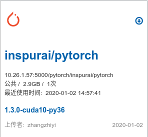

## System Info

```bash
OS:			Ubuntu 18.04.3 LTS
Kernel: 	3.10.0-693.el7.x86_64
Machine:	Docker
Location:	AIStation, nclab_2080ti
```




## CPU Info

```bash
Intel(R) Xeon(R) Gold 5118 CPU @ 2.30GHz ×2, $1273.00
12 cores, Sky Lake-2017, TDP=105 W
AVX-512 (FMA=1), SMP=4 (UPI=3)
		Base	Turbo-1	Turbo-all
Normal	2.3		3.2		2.7
AVX2	1.9		3.1		2.3
AVX512	1.2		2.9		1.6
```

## GPU Info

```bash
GeForce RTX 2080 Ti ×1
```


## Benchmark #1

```bash
# Make.linux
SHELL        = /bin/sh
CD           = cd
CP           = cp
LN_S         = ln -fs
MKDIR        = mkdir -p
RM           = /bin/rm -f
TOUCH        = touch
ARCH         = linux
ifndef  TOPdir
TOPdir = /root/levi/modified/hpl-cuda
endif
INCdir       = $(TOPdir)/include
BINdir       = $(TOPdir)/bin/$(ARCH)
LIBdir       = $(TOPdir)/lib/$(ARCH)
HPLlib       = $(LIBdir)/libhpl.a

LAdir        = /opt/intel/mkl/lib/intel64
LAinc        =
LAlib        = -L $(TOPdir)/src/cuda  -ldgemm -L/usr/local/cuda/lib64 -lcuda -lcudart -lcublas -L$(LAdir) -lmkl_intel_lp64 -lmkl_intel_thread -lmkl_core -liomp5

F2CDEFS      = -DAdd__ -DF77_INTEGER=int -DStringSunStyle
HPL_INCLUDES = -I$(INCdir) -I$(INCdir)/$(ARCH) $(LAinc) $(MPinc) -I/usr/local/cuda/include

HPL_LIBS     = $(HPLlib) $(LAlib) $(MPlib)
HPL_OPTS     =  -DCUDA
HPL_DEFS     = $(F2CDEFS) $(HPL_OPTS) $(HPL_INCLUDES)

CC      = mpicc
CCFLAGS = $(HPL_DEFS) -fomit-frame-pointer -O3 -funroll-loops -W -Wall -fopenmp
CCNOOPT      = $(HPL_DEFS) -O0 -w
LINKER       = $(CC)
LINKFLAGS    = $(CCFLAGS)
ARCHIVER     = ar
ARFLAGS      = r
RANLIB       = echo
MAKE = make TOPdir=$(TOPdir)

# run_linpack
HPL_DIR=/root/levi/modified/hpl-cuda
CPU_CORES_PER_GPU=1
export CUDA_VISIBLE_DEVICES=0
export MKL_NUM_THREADS=$CPU_CORES_PER_GPU
export GOTO_NUM_THREADS=1
export OMP_NUM_THREADS=1
export MKL_DYNAMIC=FALSE
export CUDA_DGEMM_SPLIT=0.80
export CUDA_DTRSM_SPLIT=0.70
export LD_LIBRARY_PATH=$HPL_DIR/src/cuda:$LD_LIBRARY_PATH
mpirun -np 1 $HPL_DIR/bin/linux/xhpl

# HPL.dat
6            device out (6=stdout,7=stderr,file)
1            # of problems sizes (N)
25000         Ns
1            # of NBs
768          NBs
0            PMAP process mapping (0=Row-,1=Column-major)
1            # of process grids (P x Q)
1            Ps
1            Qs
16.0         threshold
1            # of panel fact
0            PFACTs (0=left, 1=Crout, 2=Right)
1            # of recursive stopping criterium
2            NBMINs (>= 1)
1            # of panels in recursion
2            NDIVs
1            # of recursive panel fact.
0            RFACTs (0=left, 1=Crout, 2=Right)
1            # of broadcast
0            BCASTs (0=1rg,1=1rM,2=2rg,3=2rM,4=Lng,5=LnM)
1            # of lookahead depth
1            DEPTHs (>=0)
1            SWAP (0=bin-exch,1=long,2=mix)
192           swapping threshold
1            L1 in (0=transposed,1=no-transposed) form
1            U  in (0=transposed,1=no-transposed) form
1            Equilibration (0=no,1=yes)
8            memory alignment in double (> 0)
```

```bash
# Result
WR10L2L2       25000   768     1     1              36.31              2.869e+02
```

```bash
WR10L2L2       25000   768     1     1              37.54              2.775e+02
WR10L2L2       30000   768     1     1              54.87              3.281e+02
WR10L2L2       35000   768     1     1              85.45              3.345e+02
WR10L2L2       40000   768     1     1             116.85              3.652e+02
```

