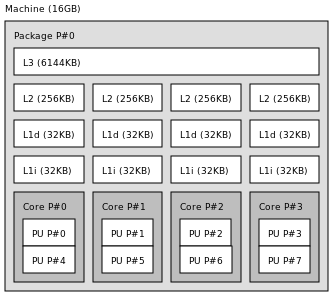

## CPU Info

```bash
Intel(R) Core(TM) i7-7700HQ CPU @ 2.80GHz,
4 cores, Kaby Lake, 
AVX2
```




## Single Core Test

```bash
# Matrix
-np = 1, cpu_freq = 2.5 GHz, flops_PC = 16,
Rpeak = 40 GHz, 
N=10000, NB=256, P=1, Q=1
```

| Gflops      | OpenMPI    | MPICH      | Intel MPI  |
| ----------- | ---------- | ---------- | ---------- |
| netlib-blas |            | 2.1288e+00 |            |
| atlas       |            | 9.4643e+00 |            |
| openblas    |            | 3.4410e+01 | 3.4475e+01 |
| Intel MKL   | 3.6182e+01 | 3.6206e+01 | 3.6211e+01 |

* It seems very little different using `mpirun.mpich` , `mpirun.openmpi`, or `mpirun.intel`
* Also no different to config `alternative-update`

* It may because when using only one CPU, there is no role for MPI to play.

* If `flops_PC = 16`, then `Rpeak = 40 GHz`. This sounds reasonable, since `Rmax = 36 GHz`, it achieve `Efficiency = 90.5%`

* `Rmax` tend to increase as time increase, since CPU needs time to focus.
    * `Ns=12000, Rmax=3.6473e+01`  `Ns=16000, Rmax=3.6893e+01`  `Ns=20000, Rmax=3.7124e+01`  `Ns=24000, Rmax=3.7243e+01`
    * So achieve `Efficiency = 93.1%`

```bash
# Summery
-np = 1, cpu_freq = 2.5 GHz, flops_PC = 16,
Rpeak = 40 Gflops, 
N=24000, NB=256, P=1, Q=1
Rmax = 37.243 Gflops, Efficiency = 93.1%
```


## Test Script

```bash
#!/bin/bash
cp HPL.dat bin/linux/
cd bin/linux
nice -n -20 taskset --cpu-list 0 mpirun.intel -np 1 ./xhpl
```

```bash
make arch=linux clean_arch_all ; make arch=linux
./run
```

I use `nice` and `taskset`, in order to avoid context switch, so can achieve high-resolution and stable result.

Further solution include: 

1. Interrupt mask to prevent interrupts on certain CPU: [How to give a single process its own CPU core in linux](http://www.hydrogen18.com/blog/howto-give-a-single-process-its-own-cpu-core-in-linux.html)
* check cpuset : `lstopo --no-io --no-caches -c`
2. Kernel boot (GRUB) parameter to avoid kernel using certain CPU
3. Close Hyper-Thread
4. Cgroup to isolate CPUs


## Question

* `mpirun -np 1 ./xhpl # without taskset` + `P=1; q=1` will still run ON 8 cores?


